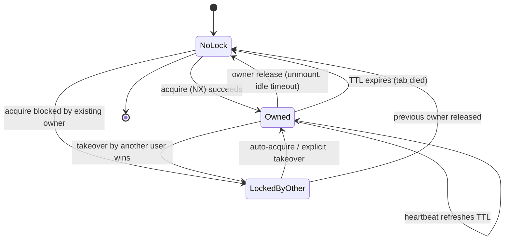
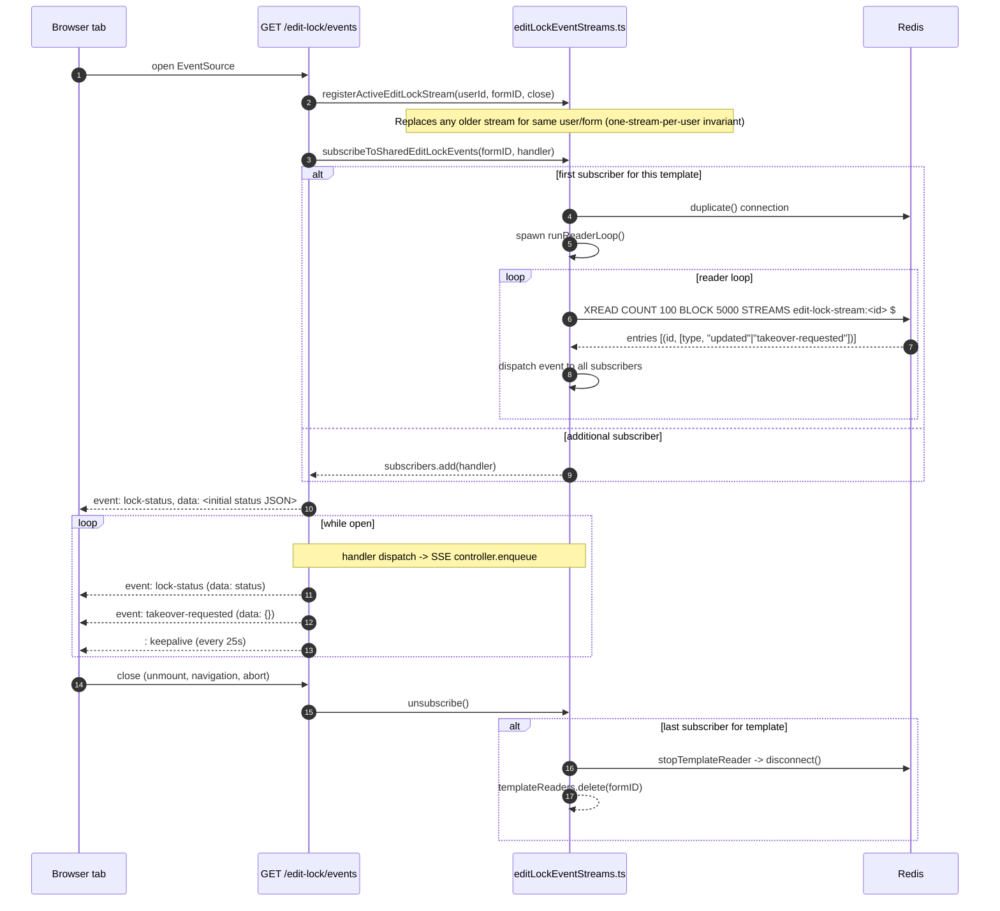
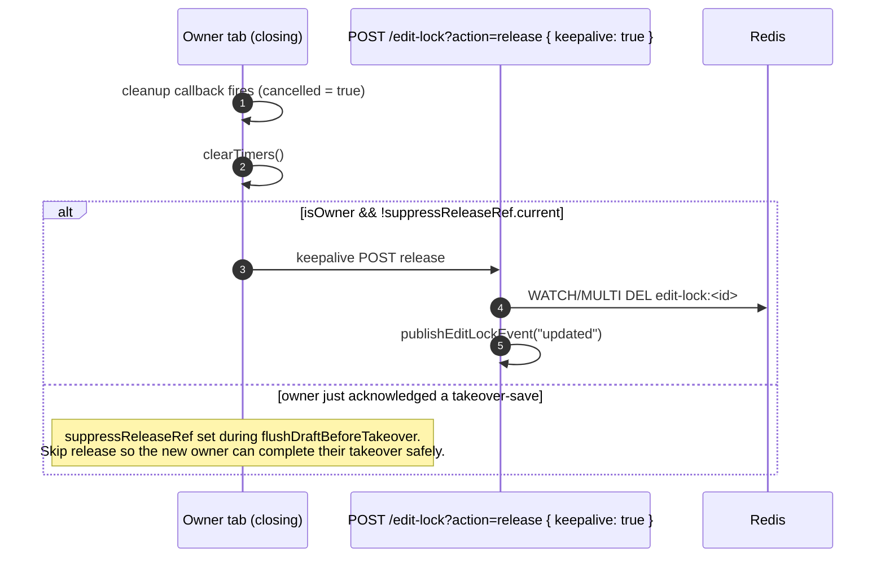

# Edit Lock Flows

The form-builder edit lock prevents two collaborators from silently editing the
same template at the same time. State lives in Redis (with an in-memory fallback
for tests), is broadcast over per-template SSE streams, and is reconciled on the
client by [`useEditLock`](../lib/hooks/form-builder/useEditLock.tsx).

This document captures the flow of each major operation as a separate Mermaid
diagram so reviewers can read the parts in isolation.

## Glossary

| Term                          | Meaning                                                                                          |
| ----------------------------- | ------------------------------------------------------------------------------------------------ |
| **Owner**                     | The browser tab that currently holds the lock for a template.                                    |
| **Non-owner**                 | Any other tab that is editing the same template (different user, different tab, or both).       |
| **Heartbeat**                 | Owner-only POST `/edit-lock` with `action=heartbeat` that refreshes TTL.                         |
| **Status poll**               | Non-owner GET `/edit-lock?requestType=lock-status-poll` while waiting for the lock to free up.   |
| **SSE stream**                | Per-template `text/event-stream` at `/edit-lock/events`; pushes `lock-status` and `takeover-requested`. |
| **Idle timeout**              | Client-side inactivity timer (`CLIENT_SIDE_EDIT_LOCK_INACTIVE_TIMEOUT_MS`). Owner releases when this fires. |
| **TTL expiry**                | Server-side `EDIT_LOCK_TTL_MS` deadline. Used as a backstop if the owner's tab dies. |
| **Pre-takeover save**         | A short window before a takeover during which the current owner flushes any dirty draft.        |

## High-level state machine



## 1. Acquire

The client mounts `useEditLock`, then POSTs `acquire`. The server uses Redis
`SET … NX EX` so only the first concurrent caller wins; everyone else gets the
existing lock back as a "locked by other" status.

```mermaid
sequenceDiagram
    autonumber
    participant Tab as Browser tab
    participant API as POST /edit-lock?action=acquire
    participant Locks as lib/editLocks.ts
    participant Redis

    Tab->>API: { action: "acquire", sessionId, activity? }
    API->>Locks: acquireEditLock(...)
    Locks->>Redis: GET edit-lock:<id>
    alt no existing lock
        Locks->>Redis: SET edit-lock:<id> ... NX EX ttl
        Redis-->>Locks: OK (won) | null (lost race)
        alt lost race (NX returned null)
            Locks-->>API: re-read status
        else won
            Locks-->>Locks: publishEditLockEvent("updated")
        end
    else existing lock owned by us
        Locks->>Redis: SET (refresh TTL)
        Locks-->>Locks: publishEditLockEvent("updated")
    else existing lock owned by other user
        Note over Locks: do NOT publish; just return current owner
    end
    Locks-->>API: EditLockStatus { isOwner, lockedByOther, lock }
    API-->>Tab: 200 status JSON
    alt isOwner
        Tab->>Tab: startHeartbeat()
    else lockedByOther
        Tab->>Tab: startPolling() (active tab only)
    end
```

## 2. Heartbeat (owner only)

Every `EDIT_LOCK_HEARTBEAT_INTERVAL_MS` the owner refreshes the TTL while it
still holds the lock. The server validates that the requester is still the
owner (matching `userId` and, when present, `sessionId`) before extending it.
Anything else means the owner has lost the lock and needs to switch into the
non-owner path.

```mermaid
sequenceDiagram
    autonumber
    participant Tab as Owner tab
    participant API as POST /edit-lock?action=heartbeat
    participant Locks as heartbeatEditLock
    participant Redis

    loop every EDIT_LOCK_HEARTBEAT_INTERVAL_MS
        Tab->>API: { action: "heartbeat", sessionId, activity }
        API->>Locks: heartbeatEditLock
        Locks->>Redis: WATCH + GET edit-lock:<id>
        alt no lock OR different owner OR different sessionId
            Locks-->>API: status (isOwner=false)
            API-->>Tab: status
            Tab->>Tab: clearTimers(); switch to non-owner path
        else still owner
            Locks->>Redis: MULTI SET (refreshed TTL) EXEC
            Locks-->>API: status (isOwner=true)
            API-->>Tab: status
            Tab->>Tab: updateStore(status)
        end
    end
```

## 3. Takeover

A non-owner user clicks "Take over". The server asks the current owner (over
SSE) to flush any pending draft, waits for an acknowledgement (or a hard
timeout), then atomically replaces the lock.

```mermaid
sequenceDiagram
    autonumber
    participant NonOwner as Non-owner tab
    participant API as POST /edit-lock?action=takeover
    participant Locks as lib/editLocks.ts
    participant Redis
    participant Owner as Current owner tab (via SSE)

    NonOwner->>API: { action: "takeover", sessionId }
    API->>Locks: getEditLockStatus(formID, userId)
    alt currently locked by someone else
        API->>Locks: clearEditLockTakeoverSaveAcknowledgement(currentOwnerSessionId)
        API->>Locks: requestEditLockTakeoverSave(templateId)
        Locks->>Redis: XADD edit-lock-stream:<id> type=takeover-requested
        Redis-->>Owner: SSE "takeover-requested"
        Owner->>Owner: flushDraftBeforeTakeover() -> saveDraft()
        Owner->>API: POST action=takeover-save-complete
        API->>Locks: acknowledgeEditLockTakeoverSave (sets PX EDIT_LOCK_PRE_TAKEOVER_SAVE_WAIT_MS)
        Locks->>Redis: SET takeover-save-ack:<id>:<sessionId>
        API->>Locks: waitForEditLockTakeoverSaveAcknowledgement(timeoutMs)
        loop poll every 100ms until deadline
            Locks->>Redis: GET takeover-save-ack:<id>:<sessionId>
            alt ack present
                Locks->>Redis: DEL takeover-save-ack:<id>:<sessionId>
                Locks-->>API: true (saved in time)
            else deadline reached
                Locks-->>API: false (proceed anyway)
            end
        end
    end
    API->>Locks: takeoverEditLock(...)
    Locks->>Redis: SET edit-lock:<id> ... EX ttl (overwrites)
    Locks->>Locks: publishEditLockEvent("updated")
    API-->>NonOwner: status (isOwner=true)
    NonOwner->>NonOwner: refreshForm(); startHeartbeat()
    Note over Owner: Receives "lock-status" SSE; heartbeat next tick will see isOwner=false<br/>and switch to non-owner path (auto-save dirty state, then poll)
```

## 4. SSE setup and event delivery

Every tab opens one `EventSource` to the per-template stream. On the server,
multiple SSE handlers for the same template share a single Redis `XREAD BLOCK`
reader. When the last subscriber disconnects, the reader loop is stopped and
the dedicated Redis connection is closed.



## 5. Lock-status check (non-owner polling) — with auto-acquire

When this tab does not own the lock it polls
`GET /edit-lock?requestType=lock-status-poll` every
`EDIT_LOCK_STATUS_POLL_INTERVAL_MS`. SSE pushes the same data faster, but the
poll is the safety net if an SSE event was missed.

The new behaviour: if the poll (or an SSE update) reveals the lock is **free**
— for example because the previous owner hit their idle timeout and released —
the active tab will try to take ownership automatically rather than parking on
the manual takeover overlay. Inactive tabs do not race; they fall back to the
overlay.

```mermaid
sequenceDiagram
    autonumber
    participant Tab as Non-owner tab
    participant API as GET /edit-lock?requestType=lock-status-poll
    participant Locks as getEditLockStatus
    participant Redis

    loop every EDIT_LOCK_STATUS_POLL_INTERVAL_MS (active tab only)
        Tab->>API: GET status
        API->>Locks: getEditLockStatus(formID, userId)
        Locks->>Redis: GET edit-lock:<id>
        alt lock present and TTL valid
            Locks-->>API: { locked:true, isOwner:false|true, lock }
        else lock missing or expired
            Locks->>Redis: DEL edit-lock:<id> (if expired)
            Locks-->>API: { locked:false, lock:null }
        end
        API-->>Tab: status
        alt status.isOwner === true
            Note over Tab: rare; means a takeover landed on us via another path<br/>updateStore + continue heartbeat
        else still locked by another user
            Tab->>Tab: updateStore(status)
        else lock is now free
            Tab->>Tab: clearTimers()
            alt is active tab
                Tab->>Tab: tryAutoAcquireFreeLock() -> POST acquire
                alt acquired
                    Tab->>Tab: startHeartbeat()
                else lost the NX race
                    Tab->>Tab: startPolling()
                end
            else inactive tab
                Tab->>Tab: setTakeoverFallbackState() (manual overlay)
            end
        end
    end
```

## 6. Owner idle timeout

Tracked entirely on the client. Every owner-side activity event resets a 30 min
timer (`CLIENT_SIDE_EDIT_LOCK_INACTIVE_TIMEOUT_MS`). When it fires, the tab
releases its lock so somebody else can take over without waiting for the
server-side TTL.

```mermaid
sequenceDiagram
    autonumber
    participant User
    participant Presence as useEditLockPresence
    participant Idle as useEditLockInactiveUser
    participant Hook as useEditLock
    participant API as POST /edit-lock?action=release
    participant Redis

    Note over Presence,Idle: While owner: pointerdown / keydown / focus / input / visibilitychange<br/>throttle to once per second; each event calls startOwnerIdleTimer()
    User--xPresence: stops interacting
    Note over Idle: setTimeout(CLIENT_SIDE_EDIT_LOCK_INACTIVE_TIMEOUT_MS) fires
    Idle->>Hook: onOwnerIdleTimeout()
    Hook->>Hook: clearTimers(); setTakeoverFallbackState() (UI flips immediately)
    Hook->>API: POST action=release
    API->>Redis: WATCH/MULTI DEL edit-lock:<id>
    API->>API: publishEditLockEvent("updated")
    API-->>Hook: { released: true }
    Hook->>Hook: clearEvents() (close SSE)
    Note over Hook: Other tabs receive lock-status SSE with locked=false →<br/>active tab will auto-acquire (see flow #5)
```

## 7. Release on unmount / tab close

The route handler `useEffect` cleanup posts `release`. Modern browsers will
cancel in-flight `fetch` calls when the tab unloads, so we set
`keepalive: true` to make sure the request still leaves the device. The
release request also runs on regular component unmounts (e.g. user navigates
to a different page within the SPA).



## Where the pieces live

| Concern                                         | File |
| ----------------------------------------------- | ---- |
| Server: lock primitives, status, takeover       | [lib/editLocks.ts](../lib/editLocks.ts) |
| Server: per-template SSE pub/sub                | [lib/editLockEventStreams.ts](../lib/editLockEventStreams.ts) |
| Server: status payload type guard               | [lib/editLockStatus.ts](../lib/editLockStatus.ts) |
| Server: route handlers                          | [app/api/templates/[formID]/edit-lock/route.ts](../app/api/templates/%5BformID%5D/edit-lock/route.ts), [app/api/templates/[formID]/edit-lock/events/route.ts](../app/api/templates/%5BformID%5D/edit-lock/events/route.ts) |
| Client: orchestration + intervals + SSE         | [lib/hooks/form-builder/useEditLock.tsx](../lib/hooks/form-builder/useEditLock.tsx) |
| Client: presence/activity reporting             | [lib/hooks/form-builder/useEditLockPresence.tsx](../lib/hooks/form-builder/useEditLockPresence.tsx) |
| Client: owner idle timeout                      | [lib/hooks/form-builder/useEditLockInactiveTimeout.tsx](../lib/hooks/form-builder/useEditLockInactiveTimeout.tsx) |
| Constants (intervals, TTL, thresholds)          | [lib/formBuilderEditLockPresence.ts](../lib/formBuilderEditLockPresence.ts) |
